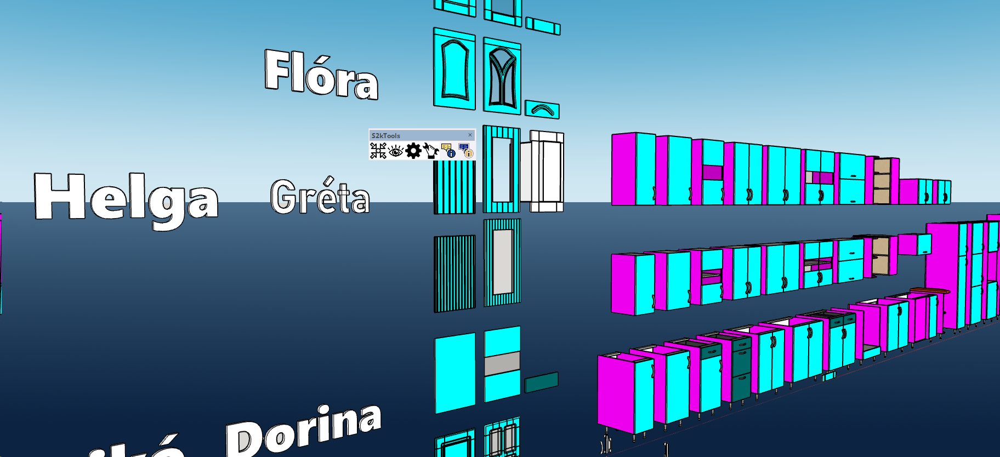

# s2kTools — Small tools for SketchUp

A small, focused SketchUp toolkit for everyday modeling and Dynamic Component (DC) workflows.

## Features

- **Match Size Tool**  
  Two clicks: 1) target element (Group/Component), 2) source element → the target takes on the source’s size.  
  - *DC-friendly*: if the target has a **Class=buildable** DC and has **LenX/LenY/LenZ**, the tool writes those and triggers a **DC redraw** (non-destructive).
  - For a regular Group/Component the tool scales along world axes.

- **Set Attribute Main**  
  Quick DC attribute injection and formula setup (centimeter workflow):
  - `direction` (LIST), `front_type` (LIST), `handle` (LIST),  
    `handle_material` (LIST → material name), `front_thickness` (cm),  
    `handleoffset` (FORMULA, cm).
  - The DC material automatically comes from the `handle_material` list (hidden from the Options dialog).

- **Fix Group Axes**  
  “Healthy” group axes configuration (workflow-friendly).

- **Move Model to Origin**  
  Quickly snap the model near (0,0,0).

- **Export View to PDF**  
  Fast export of the current view.

> Tip: Toolbar icons live in the `images/` folder. Button tooltips help guide usage.

